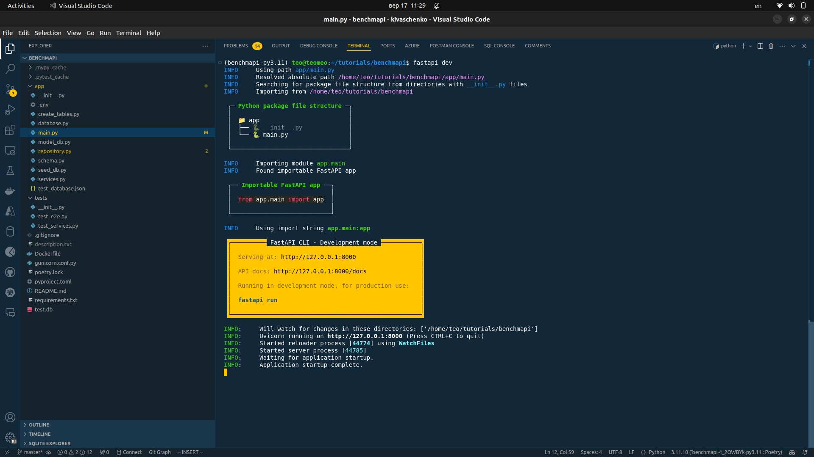
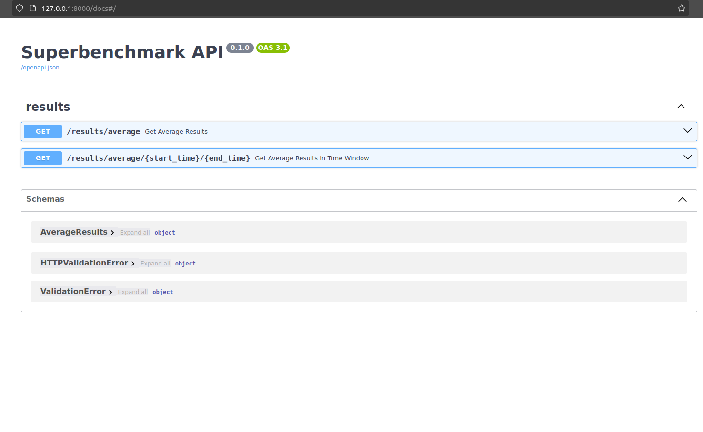
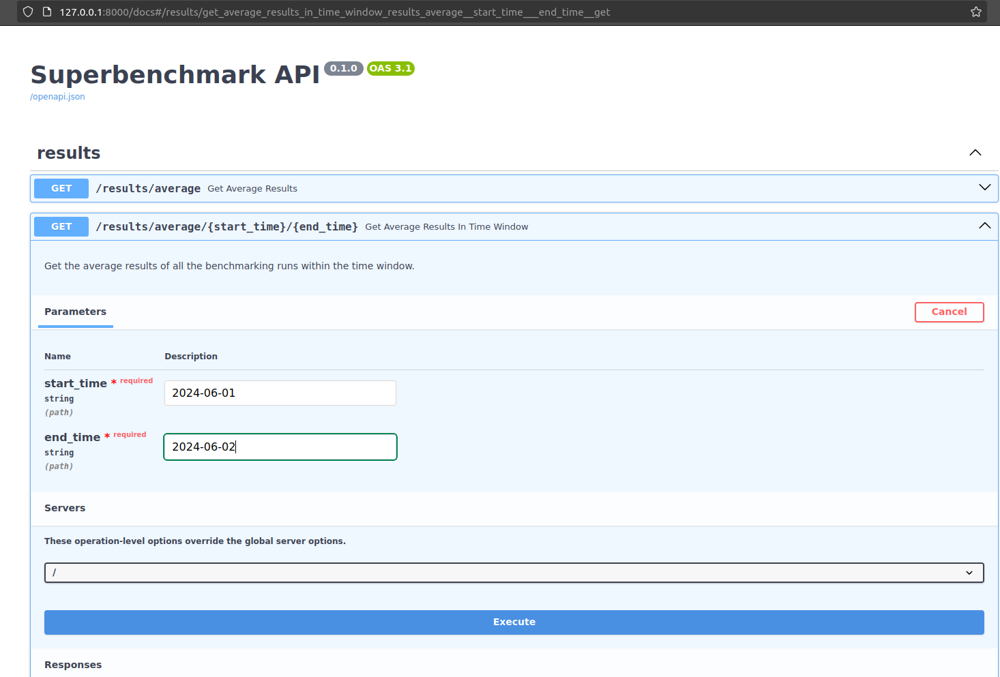
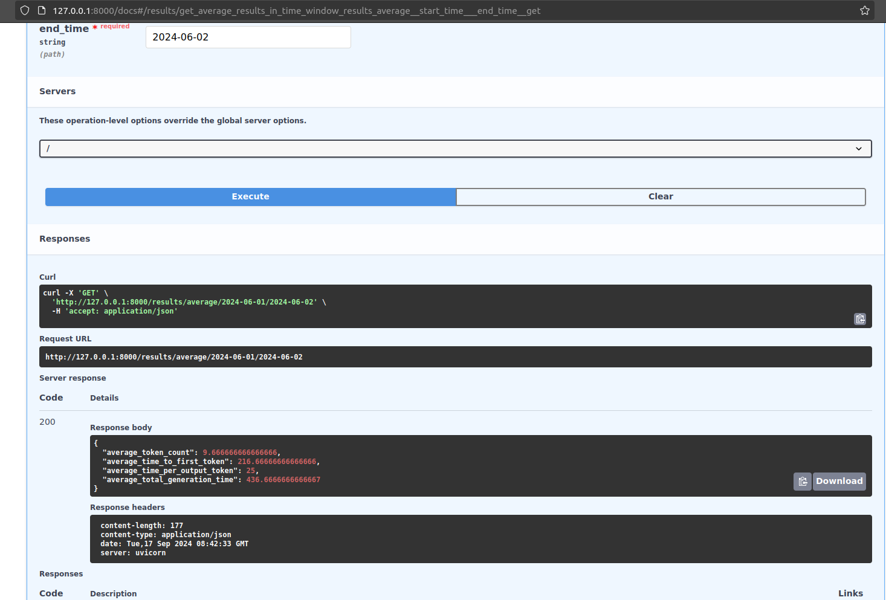
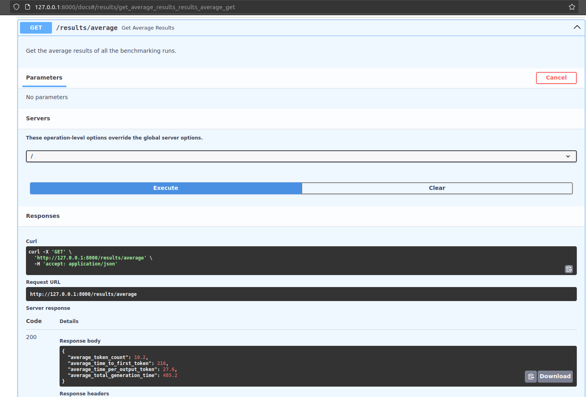

## Running the Application in Debug Mode

### Set Up Environment Variables

To use from `.json` file set `DEBUG=True`, to use DB - set `False`

#### Pip

Ensure you have a `.env` file in the root of your project with the following content:

```
DATABASE_URL=sqlite:///./test.db
SUPERBENCHMARK_DEBUG=True
```

Install Dependencies
Install the required dependencies using pip:
```
pip install -r requirements.txt
```
Create Database Tables
Run the script to create the database tables:
```
python create_tables.py
```
Seed the Database
Run the script to seed the database with test data:
```
python seed_db.py
```
Run the FastAPI Application
Start the FastAPI application using uvicorn:
```
uvicorn main:app --reload
```

#### Poetry
Install Dependencies
Install the required dependencies using Poetry:
```
poetry install
```
Create Database Tables
```
poetry run python create_tables.py
```
Run the script to create the database tables:
Seed the Database
Run the script to seed the database with test data:
```
poetry run python seed_db.py
```

Run the FastAPI Application
Start the FastAPI application using the development server:

```
poetry run uvicorn main:app --reload
```
or
```
poetry shell
fastapi dev
```


For create tables and seed from file:
```
python -m app.create_tables
python -m app.seed_db
```

## Docker
Create image
```
docker build --tag benchmark-demo .
```
Run container
```
docker run -p 8000:8000 -d benchmark-demo
```
Check
[localhost:8000/docs](localhost:8000/docs)







